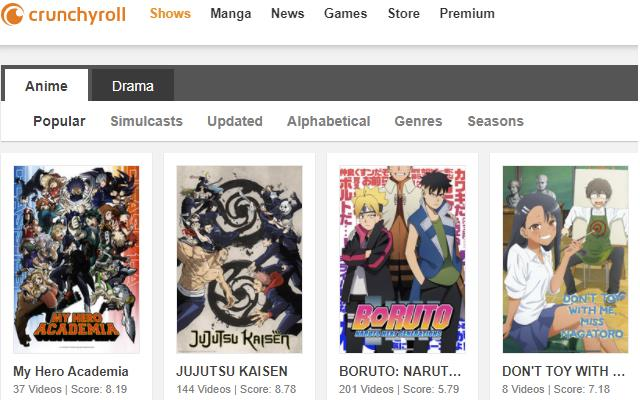
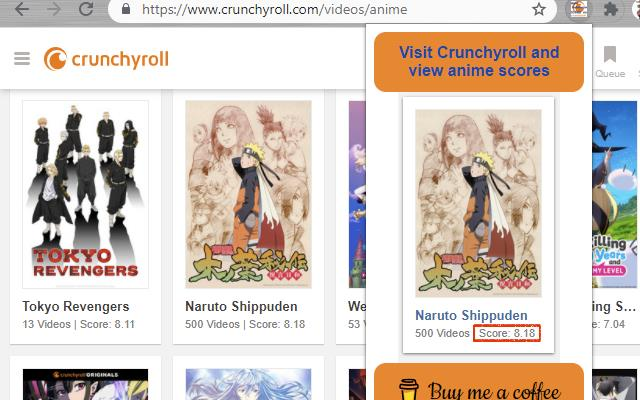
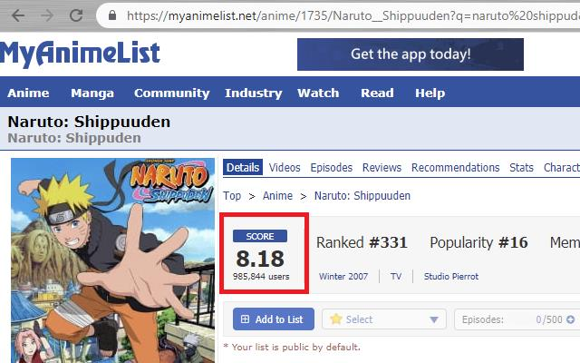
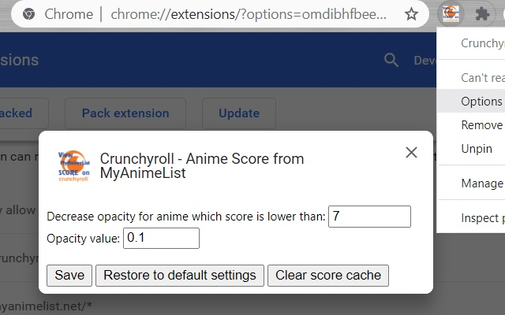

	

> Available on Chrome Web Store:  
> https://chrome.google.com/webstore/detail/crunchyroll-anime-score-f/gmbngnmhdghglmgofmeikkaeipbeoknh?hl=en

1) Visit Crunchyroll.com
2) Browse Anime / Shows
3) Thanks to this extension you will be able to see the score of each Anime
4) The score is requested to MyAnimeList.net -it will be cached-.
5) Pick an Anime and enjoy it!

---

> Showcase 1 (standard view):

	

---

> Showcase 2 (clicking on the extension icon):

	

---

> Showcase 3 (score obtained from MyAnimeList.net):

	

---

> Showcase 4 (fade low score shows setting the opacity in the options):

	

---

